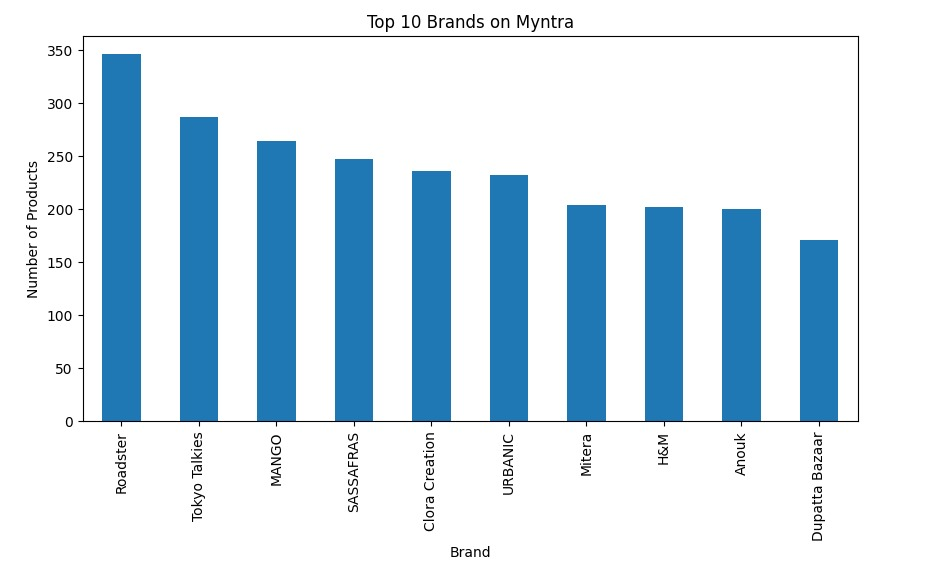
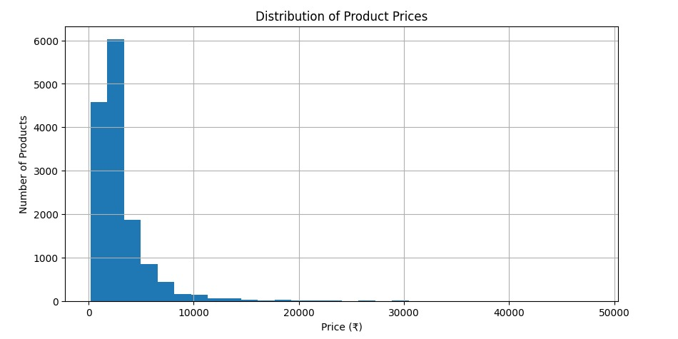
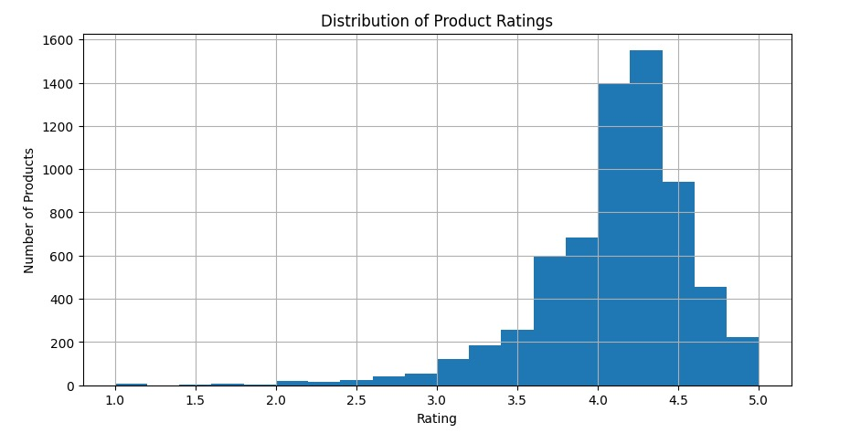
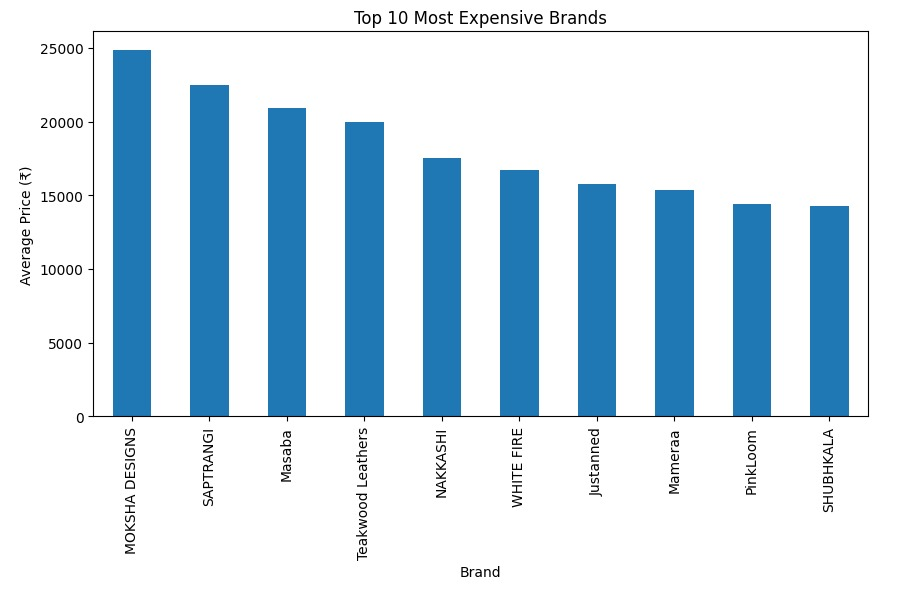

# Myntra Fashion Trends Analysis

## Overview

This project analyzes a Myntra fashion products dataset containing over 14,000 products. The objective was to explore pricing patterns, brand popularity, and customer ratings using Python and data visualization techniques.

The analysis was performed using Pandas for data manipulation and Matplotlib for visualization.

---

## Dataset

| Metric | Value |
|----------|----------|
| Total Products | 14,330 |
| Total Features | 11 |
| Dataset Type | Fashion Products |
| Tools Used | Python, Pandas, Matplotlib |

---

## Objectives

- Understand brand distribution across products
- Analyze product pricing trends
- Explore customer rating patterns
- Identify premium brands based on average pricing

---

## Data Preparation

The dataset was cleaned before analysis.

Steps performed:

- Removed unnecessary index column
- Checked for missing values
- Removed incomplete records where required
- Verified data types and column structure

---

## Technologies Used

- Python
- Pandas
- NumPy
- Matplotlib
- Jupyter Notebook

---

## Analysis

### Top Brands

Roadster had the highest number of products in the dataset, followed by Tokyo Talkies and MANGO.



---

### Product Price Distribution

Most products are concentrated in lower price ranges, while premium products form a long-tail distribution.



---

### Rating Distribution

The majority of products have ratings between 4.0 and 4.5, indicating generally positive customer feedback.



---

### Most Expensive Brands

The following brands recorded the highest average product prices:

- MOKSHA DESIGNS
- SAPTRANGI
- Masaba
- Teakwood Leathers
- NAKKASHI



---

## Key Findings

- Roadster was the most represented brand in the dataset.
- The average product price was approximately ₹2964.
- Most products were priced below ₹5000.
- Customer ratings were concentrated between 4.0 and 4.5.
- Premium brands showed significantly higher average pricing than the overall market.

---

## Future Improvements

Possible extensions for this project include:

- Interactive dashboard development using Streamlit
- Product recommendation system
- Customer review sentiment analysis
- Machine learning based trend prediction

---

## Repository Structure

```text
Myntra-Fashion-Trends-Analysis
│
├── README.md
├── myntra_analysis.ipynb
├── myntra_analysis.html
├── top_brands.png.jpeg
├── price_distribution.png.jpeg
├── rating_distribution.png.jpeg
├── myntra_logo.png.webp
└── expensive_brands.png.jpeg
```

---

## Running the Project

Install dependencies:

```bash
pip install pandas numpy matplotlib
```

Launch Jupyter Notebook:

```bash
jupyter notebook
```

Open:

```text
myntra_analysis.ipynb
```

and run all cells.
